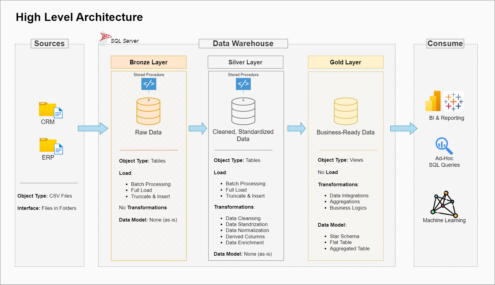

# Data Warehouse and Analytics Project

Welcome to the **Data Warehouse and Analytics Project** repository! 🚀  
This project provides a comprehensive data warehousing and analytics solution, covering everything from the creation of a data warehouse to generating actionable insights. As a portfolio project, it highlights industry best practices in data engineering and analytics.

---
## 📖 Project Overview

This project includes the following:

1. **Data Architecture**: Building a Modern Data Warehouse utilizing the Medallion Architecture with **Bronze**, **Silver**, and **Gold** layers.
2. **ETL Pipelines**: Extracting, transforming, and loading data from source systems into the data warehouse.
3. **Data Modeling**: Creating fact and dimension tables optimized for analytics.
4. **Analytics & Reporting**: Generating SQL-based reports and dashboards for actionable insights.

🎯 This repository is a great resource for professionals and students aiming to demonstrate expertise in:
- SQL Development
- Data Architecture
- Data Engineering  
- ETL Pipeline Development  
- Data Modeling  
- Data Analytics  

---

## 🛠️ Important Links & Tools:

Tools used in this projects!  
- **[Datasets](datasets/):** Access to the project dataset (CSV files).
- **[SQL Server Express](https://www.microsoft.com/en-us/sql-server/sql-server-downloads):** Lightweight server for hosting your SQL database.
- **[SQL Server Management Studio (SSMS)](https://learn.microsoft.com/en-us/sql/ssms/download-sql-server-management-studio-ssms?view=sql-server-ver16):** GUI for managing and interacting with databases.
- **[Git Repository](https://github.com/):** Set up a GitHub account and repository for efficient version control and collaboration.
- **[DrawIO](https://www.drawio.com/):** Tool for designing data architecture, models, and diagrams.
- **[Notion](https://www.notion.com/):** All-in-one tool for project management and organization.
- **[Notion Project Steps](https://concrete-sword-af5.notion.site/Data-WareHouse-Project-1a56bdf6cc0d8054a088edecbb54e11a):** Access to the full project phases and tasks.

---

## 🚀 Project Requirements

### Building the Data Warehouse (Data Engineering)

#### Objective
Create a modern data warehouse using SQL Server to consolidate sales data, enabling analytical reporting and informed decision-making.

#### Specifications
- **Data Sources**: Import data from two source systems (ERP and CRM), provided as CSV files.
- **Data Quality**: Cleanse and resolve data quality issues before analysis.
- **Integration**: Combine both data sources into a user-friendly data model for analytical queries.
- **Scope**: Focus only on the latest dataset; historization is not required.
- **Documentation**: Provide clear documentation of the data model for both business stakeholders and analytics teams.

---

### BI: Analytics & Reporting (Data Analysis)

#### Objective
Develop SQL-based analytics to generate detailed insights into:
- **Customer Behavior**
- **Product Performance**
- **Sales Trends**

These insights will empower stakeholders with key business metrics for strategic decision-making.

For more details, refer to [docs/requirements.md](docs/requirements.md).

---
## 🏗️ Data Architecture

This project follows the Medallion Architecture with three layers: **Bronze**, **Silver**, and **Gold**:



1. **Bronze Layer**: Stores raw data exactly as it is from the source systems, ingested from CSV files into SQL Server.
2. **Silver Layer**: Includes data cleansing, standardization, and normalization to prepare the data for analysis.
3. **Gold Layer**: Houses business-ready data modeled in a star schema for reporting and analytics.

---

## 📂 Repository Structure
```
data-warehouse-project/
│
├── datasets/                           # Raw datasets (ERP and CRM data)
│
├── docs/                               # Project documentation and architecture details
│   ├── etl.drawio                      # Draw.io file showing various ETL techniques and methods
│   ├── data_architecture.drawio        # Draw.io file outlining the project's architecture
│   ├── data_catalog.md                 # Catalog of datasets with field descriptions and metadata
│   ├── data_flow.drawio                # Draw.io file for the data flow diagram
│   ├── data_models.drawio              # Draw.io file for data models (star schema)
│   ├── naming-conventions.md           # Guidelines for consistent naming of tables, columns, and files
│
├── scripts/                            # SQL scripts for ETL and transformations
│   ├── bronze/                         # Scripts for extracting and loading raw data
│   ├── silver/                         # Scripts for cleaning and transforming data
│   ├── gold/                           # Scripts for creating analytical models
│
├── tests/                              # Test scripts and quality assurance files
│
├── README.md                           # Project overview and instructions
├── LICENSE                             # License information for the repository
├── .gitignore                          # Specifies files and directories to ignore in Git
└── requirements.txt                    # Dependencies and requirements for the project
```

---

## 🛡️ License

This project is licensed under the [MIT License](LICENSE). Feel free to use, modify, and share this project with proper attribution.
